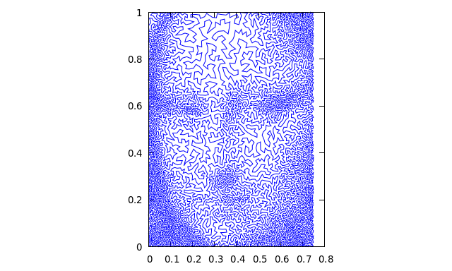

# TSP Art by Simulated Annealing

The Traveling Salesman Problem (TSP) (https://en.wikipedia.org/wiki/Travelling_salesman_problem) is one of the most renowned problems in the NP-hard category. A lot of brainpower is currently being invested on research for better performing heuristics to tackle the TSP.

One such algorithm is given by the technique of Simulated Annealing (SA for short), which uses a process reminiscent of Monte Carlo procedures in order to evaluate a simil Maxwell-Boltzmann probability $e^{-\frac{E}{T}}$, where $E$ is the total length of a certain path and T is a parameter that sets how likely it is for the current path to change towards a higher length (for a more in-depth description of SA look on https://en.wikipedia.org/wiki/Simulated_annealing).

## Recreating paintings as TSP problems

Mathemtician Robert Bosch (https://www2.oberlin.edu/math/faculty/bosch/tspart-page.html) has created instances of TSP which include $\tilde 10^5$ points which recreate paintings by the likes of Leonardo and Botticelli. This project attempts to find an accettable (i.e. good looking) solution to some of these problems by implementing a variation on the SA algorithm. The technique is described in the article https://matthewmcgonagle.github.io/blog/2018/06/09/TSPArtModifiedAnnealing. The project is entirely written in C++.

## The algorithm
We now explain the structure of the algorithm. For further reference have a look at https://matthewmcgonagle.github.io/blog/2018/06/09/TSPArtModifiedAnnealing.

### Greedy guess

The initial configuration in Robert Bosch's dataset is simply obtained by shuffling the points in a random order. This path is therefore incredebly far from a local minimum.

In order to start the SA algorithm on a more reasonable configuration, we will rely on a *greedy guess*: we will start from a random point (e.g. the first one in the dataset) and move *towards the closest point which has not been visited yet*. The resulting path, applied on Mona Lisa's enigmatic smile, can be found in https://github.com/s1m0n32001/TSP-Art/blob/main/2_Scale/guesser.png. As one can see, anyone who would print this and hang it in their room is clearly in need of help. An eventual application of SA on this path will make it more easy on the eyes.

### Scale-based simulated annealing

We now apply SA on the path outputted by the greedy guess, with a small difference: instead of allowing the program to reverse the tour between two randomly selected points, we restrict the pool of possible points to *the set of points which are at the end of long edges*. We fine-tuned the program to allow smaller and smaller edges to be reversed as the temperature decreases. The result can be found in https://github.com/s1m0n32001/TSP-Art/blob/main/2_Scale/scale.png.

### Neighbours-based simulated annealing.
The final touch is another implementation of SA, only this time allowing a reversal of the path *only on points that are close neighbours*. The program will restrict the pool of neighbours (i.e. points that are within the $k$ closest points of each other) as the temperature $T$ decreases. 

The final result, applied on Mona Lisa's smile, is found at https://github.com/s1m0n32001/TSP-Art/blob/main/3_Neighbour/neigh.png.

## Results
After testing it on Mona Lisa's smile, which is just a subset of the whole Mona Lisa dataset, we ran the code on three different datasets: Mona Lisa, Birth of Venus and finally The Girl with the Pearl Earring. The results (uploaded in low resolution because of github's large files policy) are reported below and can be found and downloaded from this repository.

### Lengths

Mona Lisa (100k points): 3.89% more than the current record
Venus (140k points):  4.33% more than the current record
Earring: 6.54% more than the current record

